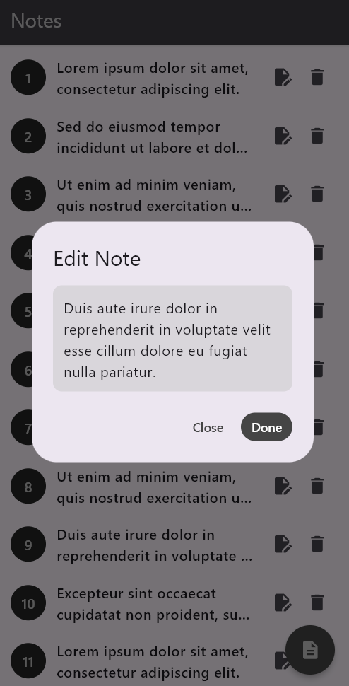

# TO-DO App 📋

This is a simple Flutter-based TO-DO app that allows users to manage their notes. It includes functionality for adding, editing, viewing, and deleting notes with a clean and user-friendly interface. This project was created as part of my Flutter learning journey.

## Features 🚀
- **Add Notes**: Users can create new notes using a pop-up dialog.
- **Edit Notes**: Existing notes can be updated through the same dialog.
- **View Notes**: Click on a note to view its full content in a dialog box.
- **Delete Notes**: Remove notes easily with a single click.
- **Persistent UI**: Clean and modern design with a focus on user experience.
- **Demo Data**: Preloaded notes for testing purposes (can be replaced with your own data).

## Screenshots 📸

### 1. Home Screen
The main screen displaying the list of notes.


---

### 2. Add Note
The dialog box for adding a new note.


---

### 3. Edit Note
The dialog box for editing an existing note.


---

### 4. Notes List
View of a list with multiple notes.


## How It Works 🛠️
1. **Adding Notes**: 
   - Tap the floating action button (`+`) to open a dialog.
   - Enter your note and click "Add".

2. **Editing Notes**: 
   - Tap the edit icon ✏️ on a specific note to open the dialog.
   - Modify the note and click "Done".

3. **Deleting Notes**:
   - Tap the trash icon 🗑️ on a specific note to delete it.

4. **Viewing Notes**:
   - Tap on a note to open it in a dialog box.

## Technologies Used 💻
- **Flutter**: Cross-platform framework for building beautiful UIs.
- **Dart**: The programming language behind Flutter.

## Design 🖌️
- **UI Theme**: Dark theme with consistent color tones.
- **Floating Action Button**: For adding new notes.
- **Dialogs**: Used for note input and viewing.

## Demo Notes 📑
This app comes with a list of preloaded demo notes to demonstrate its functionality. These can be replaced by editing the `Notes` list in the code.

```dart
var Notes = [
  'Lorem ipsum dolor sit amet, consectetur adipiscing elit.',
  'Sed do eiusmod tempor incididunt ut labore et dolore magna aliqua.',
  'Ut enim ad minim veniam, quis nostrud exercitation ullamco laboris nisi ut aliquip ex ea commodo consequat.',
  ...
];
```
## How to Run 🏃‍♂️

1. **Clone the repository**:
   ```bash
   git clone https://github.com/TanjidulIslamToha/TO-DO-App.git
   ```
2. **Navigate to the project directory**:

```bash
   Copy code
   cd TO-DO-App
```
3. **Run the Flutter app**:

```bash
  Copy code
  flutter run
```
